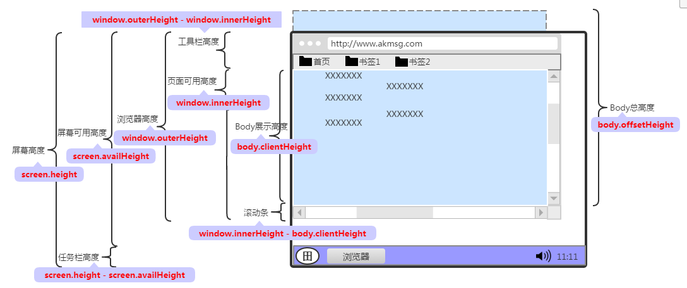

参考 https://developer.mozilla.org/zh-CN/docs/Web/HTML/Element

## html尺寸



这里的body现在改为document.documentElement。然后使用document.documentElement.clientWidth获得页面宽度。

### html语意化


### 块级元素

1. div，块元素，就像一个大盒子，可以放各式各样的东西，如：图片....

2. p，块元素，它通常是用来放一段话的....

3. h1,h2....h6标签，块级元素，常用来放标题

4. span，行内元素，常用来处理一段话中的某几个字符

5. img，用来加载图片的标签

6. table，用来创建表格的标签

7. br，用来换行的标签

8. hr，用来画线的标签

9. a，点击跳转的超链接标签

10. ul，无序列表的标签
11. ol，表示多个有序列表项，通常渲染为有带编号的列表。
12. li表示列表里的条目
13. **body 元素**表示文档的内容。[`document.body`](https://developer.mozilla.org/zh-CN/docs/Web/API/Document/body) 属性提供了可以轻松访问文档的 body 元素的脚本，必须是html的直接子元素。

### 行内元素


### meta元数据标签

1. **<base> 元素** 指定用于一个文档中包含的所有相对 URL 的根 URL。一份中只能有一个 <base> 元素。

   比如在meta里面设置了base href，那么之后的相对地址的a标签会根据这个base href进行跳转。

   ```html
   <base href="https://dowob.cn">
   <body>
     <a> href="/"</a> 点击后进入https://dowob.cn/
   </body>
   ```

2. **<head> 元素** 规定文档相关的配置信息（元数据），包括文档的标题，引用的文档样式和脚本等。如果文档中忽略了`<head>`标签，大部分浏览器会自己创建。

3. **<link>元素 **规定了当前文档与外部资源的关系。该元素最常用于链接样式表，此外也可以被用来创建站点图标(比如PC端的“favicon”图标和移动设备上用以显示在主屏幕的图标) 。

   ```html
   <link rel="icon" href="favicon.ico">
   <link href="main.css" rel="stylesheet">
   ```

4. `<meta>` 元素表示<base>, <link>, <script>, <style> 或 <title> 之外的任何元数据信息。meta是一个空标签。

   1. charset：表示当前文档所使用的字符集。`<meta charset="utf-8">`

   2. name: 定义文档级名称，与`content`属性包含的值相关联。

      - `keywords`, 包含与逗号分隔的页面内容相关的单词。

      - `robots`, 定义爬虫能够做的行为` <meta name="robots" content="index, follow">`
      - `viewport`, 它提供有关视口初始大小的提示，仅供移动设备使用。

5. `<style>`元素包含文档的样式信息或者文档的部分内容。默认情况下，该标签的样式信息通常是CSS的格式。

6. **`<title>` 元素** 定义文档的标题，显示在浏览器的标题栏或标签页上。


### Viewport

参考 https://www.cnblogs.com/2050/p/3877280.html

viewport就是设备屏幕上用来显示内容的一块区域。因为视网膜屏幕的存在，css中的1px不代表1个物理像素，可以使用`window.devicePixelRatio`查看。所谓的idea-viewport也就是宽度等于默认设备宽度，比如iphone物理宽度是1080px，视网膜下是414px，那么idea-viewport中window.innerWidth也就是414px。

下面是常见的viewport设置，表示当前viewport等于设备宽度，不允许设备缩放。

```html
<meta name="viewport" content="width=device-width, initial-scale=1.0, maximum-scale=1.0, user-scalable=0">
```

常用的属性：

| width         | 设置***layout viewport***  的宽度，为一个正整数，或字符串"width-device" |
| ------------- | ------------------------------------------------------------ |
| initial-scale | 设置页面的初始缩放值，为一个数字，可以带小数，这个缩放相对于ideal-viewport进行的。 |
| minimum-scale | 允许用户的最小缩放值，为一个数字，可以带小数                 |
| maximum-scale | 允许用户的最大缩放值，为一个数字，可以带小数                 |
| height        | 设置***layout viewport***  的高度，这个属性对我们并不重要，很少使用 |
| user-scalable | 是否允许用户进行缩放，值为"no"或"yes", no 代表不允许，yes代表允许 |

Initial-scale的值是2，那么原来1080px宽度会变为540px宽度。

默认下width与各个浏览器相关，比如iphone就是980px。因为这些默认的浏览器宽度，使得下面出现滑条。

**动态改变viewport的方法**

```js
    window.onload = () => {
      let head = document.querySelector('head meta[name="viewport"]');
      if (head) {
        head.setAttribute("content", "width=device-width,initial-scale=1");
      } else {
        let meta = document.createElement('meta');
        meta.setAttribute("content", "width=device-width,initial-scale=1")
        head = document.querySelector('head');
        head.appendChild(meta);
      }
    }
```