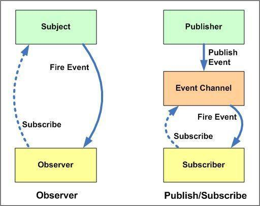

## 设计模式

### 单例模式

饿汉：不管程序是否需要这个对象的实例，总是提前创建好实例。对于多线程的程序来说这样不会出现loadSingle()时竞态。

```javascript
let loadSingle = (function() {
  function Person(name) {
    this.name = name;
    this.age = 18;
  }
  Person.prototype.print = function() {
    console.log(`${this.name}:${this.age}`);
  }
  let instance = new Person;
  return function() {
    return instance
  }
})(); //使用立即函数来创建闭包
console.log(loadSingle().print());
```


懒汉：当某个对象使用频率不高，内存占用大，这个静态类就只有在需要的时候才加载。

```javascript
let loadSingle = (function() {
  function Person(name) {
    this.name = name;
    this.age = 18;
  }
  Person.prototype.print = function() {
    console.log(`${this.name}:${this.age}`);
  }
  let instance = null;
  return function() {
    if (!instance) instance = new Person('ss');
    return instance
  }
})(); //使用立即函数来创建闭包
console.log(loadSingle().print());
```

### 观察者模式

对象（观察者）维护一个依赖列表，当对象（订阅者）发生改变时，通知它们。

```javascript
var Observer = (function() {
  let messages = {};
  return {
    regist(type, fn) {
    // 对应消息来注册方法
      if (!messages[type]) {
        messages[type] = [fn];
      } else {
        messages[type].push(fn);
      }
    },
    fire(type, args) {
    // 得到消息后通知所有订阅者
      if (!messages[type]) {
        return;
      }
      let event = {
        type,
        args: args || {}
      };
      let len = messages[type].length;
      for (let i = 0; i < len; i++) {
        messages[type][i].call(this, event);
      }
    },
    remove(type, fn) {
    // 将订阅者从消息队列中删除
      if (messages[type] instanceof Array) {
        messages[type] = messages[type].filter(f => f == fn);
      }
    }
  }
})();

Observer.regist('click', (e) => {
  console.log('click:', e);
})
let handle = (e) => {
  console.log('click:', e);
};
Observer.regist('click', handle)
Observer.fire('click', 'lalala');
Observer.remove('click', handle);
Observer.fire('click', 'lalala');
```

### 发布订阅模式

下图左边是观察者模式、右边是消息发布订阅模式，主要区别是：

1. 发布订阅模式会有一个信息中介，发布者和订阅者之间不清楚对方的存在。
2. 观察者模式直接通知订阅者，而发布订阅模式可以异步等中介去通知，发布订阅者模式耦合度更低。

